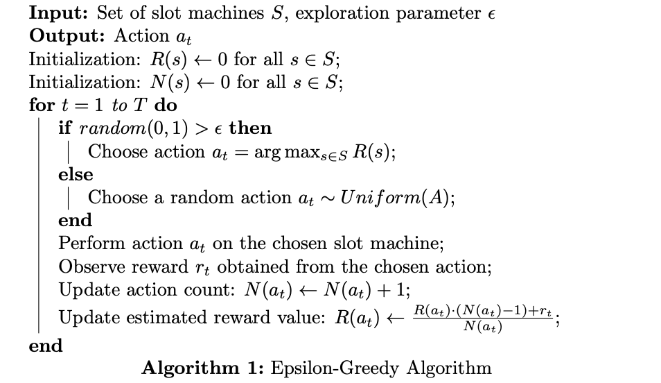

# MultiArmed Bandit Problems

## Introduction

The multi-armed bandit problem is a classic dilemma in probability theory and decision-making. A classic example is a gambler's issue in deciding which slot machine to play, where each has a different uncertain payout probability. The objective of the gambler is to maximize his total reward in a finite number of trials.

If we can explore all the possibilities without penalty, the simple solution is to play all the slot machines at every step. However, each action has a cost, and exploring some space during each period may only be feasible. Moreover, if we randomly choose a slot machine for each time step where we minimize the actions, we can not ensure that we maximize the rewards. Thus, we need to find a more intelligent strategy.

The multi-armed bandit problem aims to devise a strategy known as a policy or algorithm that maximizes the cumulative reward over a given period. The objective is to find the optimal balance between exploration and exploitation to achieve the highest possible compensation.

* **Exploration**: try different slot machines (arms) to gather information about the potential rewards.
* **Exploitation** refers to choosing the arms with promising results or higher expected rewards based on the available information.

Balancing exploration and exploitation is crucial in the multi-armed bandit problem. If you focus solely on exploitation, you may get stuck with a suboptimal arm and miss out on potentially higher rewards from other arms. Conversely, if you emphasize exploration too much, you may spend too much time gathering information and need more time exploiting the arms with higher expected rewards.

## Problem Formulation

Let's consider a set of $S$ slot machines, each denoted by $s \in S$. Each slot machine has an unknown probability distribution associated with its rewards, represented as $P(\theta_s)$. The parameter $\theta_s$ represents the probability of receiving a reward from machine $s$.

To take an action, we define a set of actions denoted by $A$. Each action $a_t$ corresponds to selecting a particular slot machine at time period $t$. The expected reward of taking action $a_t$ on machine $s$ is denoted as $\mathbb{E}[r|a_t] = \theta_s$.

The rewards of the slot machines are stochastic, meaning that they are subject to chance. Specifically, if an action $a_t$ is taken on machine $s$ at time $t$, the resulting reward $R(a_t)$ follows a probabilistic distribution. We can define this distribution as:

$$\begin{equation*}
  R(a_t) =
  \begin{cases}
    1 & \text{w.p. $\theta_{s}$} \\
    0 & \text{w.p. $1-\theta_{s}$}
  \end{cases} \\ \forall  s \in S
\end{equation*}$$

In this formulation, if the chosen action $a_t$ corresponds to pulling machine $s$ at time $t$, the reward $R(a_t)$ will be 1 with a probability of $\theta_s$, representing a successful outcome, and 0 with a probability of $1-\theta_s$, representing an unsuccessful outcome.

The goal is to maximize the cumulative reward obtained over a given time horizon. 

$$ max \, \sum_{t=0}^{T} R(a_t)  $$ 

where $R(a_t)$ represents the reward obtained at time $t$ by taking action $a_t$, and $T$ is the total number of time steps.

The cumulative regret measures the opportunity loss incurred by not choosing the best action at each time step. We can define the cumulative regret. So, If we know the optimal action with the best reward, then the goal is same as to minimize the potential regret by not picking the optimal action. We can define the cumulative regret loss function as:

$$l(T) =  \sum_{t=0}^{T} R(a^{*}) - R(a_t)$$

where $R(a^*)$ represents the reward obtained by choosing the optimal action at each time step, and $R(a_t)$ represents the reward obtained by taking action $a_t$.

## Strategies to solve the problem

### Epsilon-greedy algorithm

The **epsilon-greedy algorithm** is a simple and widely used approach in solving the multi-armed bandit problem. It strikes a balance between exploration and exploitation by selecting the best-known action most of the time (exploitation) while occasionally exploring others (exploration).

