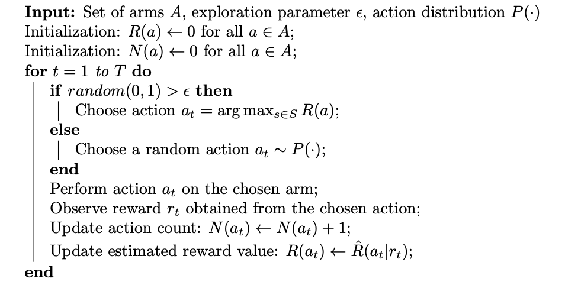
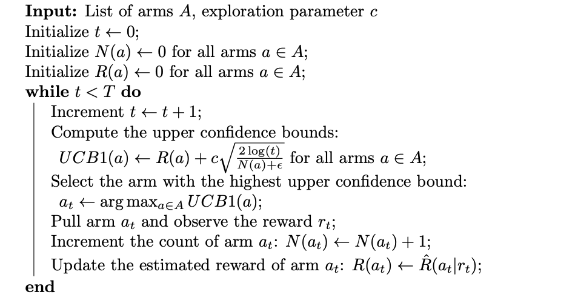

# MultiArmed Bandit Problems

## Introduction

The multi-armed bandit problem is a classic dilemma in decision-making and probability theory. It involves selecting actions from a set of options, often referred to as "arms," to maximize cumulative rewards. This problem arises in various fields, including gambling, clinical trials, online advertising, and recommendation systems.

In the multi-armed bandit problem, each arm is associated with an unknown reward distribution, and the decision-maker must strike a balance between exploration and exploitation. 

* **Exploration**: try different arms to gather information about the potential rewards.
* **Exploitation** refers to choosing the arms with promising results or higher expected rewards based on the available information.

However, exploring all possibilities without penalty is often not feasible due to the associated costs. Additionally, randomly choosing actions at each time step may not guarantee maximizing rewards. Therefore, intelligent strategies are needed to address these challenges.

Achieving the optimal balance between exploration and exploitation is critical. Focusing solely on exploitation may lead to getting stuck with a suboptimal arm and missing out on higher rewards from other arms. On the other hand, excessive exploration can result in spending too much time gathering information and delaying the exploitation of arms with higher expected rewards.

The multi-armed bandit problem aims to devise a strategy known as a policy or algorithm that maximizes the cumulative reward over a given period. The objective is to find the optimal balance between exploration and exploitation to achieve the highest possible compensation.

## Problem formulation

Let's assume:

* Set of Arms: $A = {a_1,a_2,\cdot,a_K}$.
* Each arm $a_k$ is associated with unknown probability distribution: $P_k(\cdot)$.

The goal is to maximize the cumulative reward over a given time horizon $T$ by selecting the arms strategically.

$$ max \, \sum_{t=0}^{T} R(a_t)  $$ 

At each time step $t$, the decision-maker selects an arm $a_t \in A$ based on a policy or algorithm. After selecting an arm, the decision-maker observes the true reward $r_t$, which is sampled from the reward distribution of the selected arm.

Considerations:

* $P(\cdot)$ can be any probability distribution, including discrete and continuous distributions such as: **Bernoulli, Normal, Uniform, Exponential or Custom**. 

* $\hat{R}(a_t|r_t )$ the rule to update the reward is problem-dependent, and you need to decide which is the best for your goal.

## Strategies to solve the problem

### Epsilon-greedy algorithm

The **epsilon-greedy algorithm** is a simple and widely used approach in solving the multi-armed bandit problem. It strikes a balance between exploration and exploitation by selecting the best-known action most of the time (exploitation) while occasionally exploring others (exploration).



```tex
\begin{algorithm}[H]
\SetAlgoLined
\KwIn{Set of arms $A$, exploration parameter $\epsilon$, action distribution $P(\cdot)$}

Initialization: $R(a) \leftarrow 0$ for all $a \in A$\;
Initialization: $N(a) \leftarrow 0$ for all $a \in A$\;
\For{$t = 1$ to $T$}{
    \eIf{$\text{random}(0,1) > \epsilon$}{
        Choose action $a_t = \arg\max_{s \in S} R(a)$\;
    }{
        Choose a random action $a_t \sim P(\cdot)$\;
    }
    Perform action $a_t$ on the chosen arm\;
    Observe reward $r_t$ obtained from the chosen action\;
    Update action count: $N(a_t) \leftarrow N(a_t) + 1$\;
    Update estimated reward value:
    $R(a_t) \leftarrow \hat{R}(a_t|r_t )$\;
    \Indm
}
\end{algorithm}
```


### Upper Confidence Bounds (UCB)

The UCB algorithm maintains an upper confidence bound for each arm, representing the upper limit of the expected reward for that arm. At each time step, the algorithm selects the arm with the highest upper confidence bound, allowing it to explore arms with uncertain rewards while favouring arms with potentially higher rewards. So, it is possible to explore bad actions tried in the past (*cost to pay*).

In UCB algorithm, we always select the greediest action to maximize the upper confidence bound $ \hat{U}(a_t)$ :

$$a_{t}^{UCB} = argmax_{a \in A} \hat{R}(a_t) + \hat{U}(a_t)$$


To estimate the $\hat{U}(a_t)$ a traditional method is **UCB1 Heuristic** :

$$UCB1(a_t) = \hat{R}(a_t) + c \sqrt{\frac{2*log(t)}{N(a_t)}}$$

where:
* $\hat{R}(a_t)$ is the estimated reward of arm $a_t$,
* $N(a_t)$ is the number of times arm $a_t$ has been selected,
* $t$ is the current time step, and
* $c$ is a constant that controls the trade-off between exploration and exploitation. Higher values of $c$ encourage more exploration.



```tex
\begin{algorithm}[H]
\SetAlgoLined
\KwIn{List of arms $A$, exploration parameter $c$}

Initialize $t \leftarrow 0$\;
Initialize $N(a) \leftarrow 0$ for all arms $a \in A$\;
Initialize $R(a) \leftarrow 0$ for all arms $a \in A$\;

\While{$t < T$}{
    Increment $t \leftarrow t + 1$\;
    Compute the upper confidence bounds: $UCB1(a) \leftarrow R(a) + c \sqrt{\frac{2\log(t)}{N(a) + \epsilon}}$ for all arms $a \in A$\;
    Select the arm with the highest upper confidence bound: $a_t \leftarrow \arg\max_{a \in A} UCB1(a)$\;
    Pull arm $a_t$ and observe the reward $r_t$\;
    Increment the count of arm $a_t$: $N(a_t) \leftarrow N(a_t) + 1$\;
    Update the estimated reward of arm $a_t$: $R(a_t) \leftarrow R(a_t) + \frac{r_t - R(a_t)}{N(a_t)}$\;
}
\end{algorithm}
```


### Thomson Sampling

Thomson Sampling leverages Bayesian inference to balance exploration and exploitation. Instead of keeping upper confidence bounds or value estimates for each arm, this strategy maintains a posterior distribution for each arm's reward parameter.

The algorithm starts by assigning a prior distribution to each arm's reward parameter. As observations are made, the posterior distributions are updated based on the observed rewards. At each time step, Thompson Sampling randomly samples a reward parameter from each arm's posterior distribution and selects the arm with the highest sampled value. This stochastic selection process allows for exploration of uncertain arms while exploiting arms with higher expected rewards.

The choice of prior distribution and the update rules for the posterior distributions depend on the specific problem and the assumptions made about the reward distribution. Different variations of Thompson Sampling exist, such as Beta-Bernoulli Thompson Sampling for binary rewards or Gaussian Thompson Sampling for continuous rewards, which use specific prior and posterior distributions accordingly.


```tex
\begin{algorithm}[H]
\SetAlgoLined
\KwIn{Set of arms $A$}

Initialization: Set prior distribution parameters for each arm $a \in A$\;
\For{$t = 1$ to $T$}{
    \For{$a \in A$}{
        Sample a reward from the posterior distribution: $r(a) \leftarrow$ sample a reward from $P(a)$ based on the current posterior parameters\;
    }
    Choose action $a_t = \arg\max_{a \in A} r(a)$\;
    Perform action $a_t$ on the chosen arm\;
    Observe reward $r_t$ obtained from the chosen action\;
    Update the posterior distribution parameters for the selected arm based on the observed reward\;
}
\end{algorithm}
```


## Case Study: Slot Machines

### Problem statement

Let's consider a set of $S$ slot machines, each denoted by $s \in S$. Each slot machine has an unknown probability distribution associated with its rewards, represented as $P(\theta_s)$. The parameter $\theta_s$ represents the probability of receiving a reward from machine $s$.

To take an action, we define a set of actions denoted by $A$. Each action $a_t$ corresponds to selecting a particular slot machine at time period $t$. The expected reward of taking action $a_t$ on machine $s$ is denoted as $\mathbb{E}[r|a_t] = \theta_s$.

The rewards of the slot machines are stochastic, meaning that they are subject to chance. Let's assume that, if an action $a_t$ is taken on machine $s$ at time $t$, the resulting reward $R(a_t)$ follows a probabilistic distribution (Bernoulli). We can define this distribution as:


$$\begin{equation*}
  R(a_t) =
  \begin{cases}
    1 & \text{w.p. $\theta_{s}$} \\
    0 & \text{w.p. $1-\theta_{s}$}
  \end{cases} \\ \forall  s \in S
\end{equation*}$$

In this formulation, if the chosen action $a_t$ corresponds to pulling machine $s$ at time $t$, the reward $R(a_t)$ will be 1 with a probability of $\theta_s$, representing a successful outcome, and 0 with a probability of $1-\theta_s$, representing an unsuccessful outcome.

The goal is to maximize the cumulative reward obtained over a given time horizon. 

$$ max \, \sum_{t=0}^{T} R(a_t)  $$ 

where $R(a_t)$ represents the reward obtained at time $t$ by taking action $a_t$, and $T$ is the total number of time steps.

The cumulative regret measures the opportunity loss incurred by not choosing the best action at each time step. We can define the cumulative regret. So, If we know the optimal action with the best reward, then the goal is same as to minimize the potential regret by not picking the optimal action. We can define the cumulative regret loss function as:

$$l(T) =  \sum_{t=0}^{T} R(a^{*}) - R(a_t)$$

where $R(a^*)$ represents the reward obtained by choosing the optimal action at each time step, and $R(a_t)$ represents the reward obtained by taking action $a_t$.

### Implementation details

In our implementation, we consider a uniform distribution for sampling rewards and a Beta distribution as a prior in Thomson Sampling.

The choice of a uniform distribution for sampling rewards means that each slot machine has an equal chance of yielding a reward of 1 or 0. This assumption implies that the true underlying probability $\theta_s$ for each machine is equally likely to be any value between 0 and 1. 

Regarding the prior distribution in Thomson Sampling, using a Beta distribution is a popular choice. The Beta distribution is conjugate to the Bernoulli distribution, meaning that the posterior distribution will also be a Beta distribution.

The choice of the Beta prior parameters $\alpha_a$ and $\beta_a$ depends on the prior beliefs or assumptions about each arm's reward probability. Setting $\alpha_a = \beta_a = 1$ corresponds to a non-informative prior, assuming a uniform distribution of prior successes and failures. This choice implies that the algorithm will rely solely on observed data to update the posterior distribution.


### Epsilon-greedy algorithm

For instance, in the traditional application of MABs with slot machines. We can use $P(\cdot)$ as a uniform distribution and $\hat{R}(a_t|r_t )$ as $\frac{R(a_t) \cdot (N(a_t) - 1) + r_t}{N(a_t)}$.

```tex
\begin{algorithm}[H]
\SetAlgoLined
\KwIn{Set of slot machines $S$, exploration parameter $\epsilon$}
Initialization: $R(s) \leftarrow 0$ for all $s \in S$\;
Initialization: $N(s) \leftarrow 0$ for all $s \in S$\;
\For{$t = 1$ to $T$}{
    \eIf{$\text{random}(0,1) > \epsilon$}{
        Choose action $a_t = \arg\max_{s \in S} R(s)$\;
    }{
        Choose a random action $a_t \sim \text{Uniform}(S)$\;
    }
    Perform action $a_t$ on the chosen slot machine\;
    Observe reward $r_t$ obtained from the chosen action\;
    Update action count: $N(a_t) \leftarrow N(a_t) + 1$\;
    Update estimated reward value: $R(a_t) \leftarrow \frac{R(a_t) \cdot (N(a_t) - 1) + r_t}{N(a_t)}$\;
}
\end{algorithm}
```


### Upper Confidence Bounds (UCB)

```tex
\begin{algorithm}[H]
\SetAlgoLined
\KwIn{Set of arms $A$, exploration parameter $c$}

Initialization: $R(a) \leftarrow 0$ for all arms $a \in A$\;
Initialization: $N(a) \leftarrow 0$ for all arms $a \in A$\;

\For{$t = 1$ to $T$}{
    Compute the upper confidence bounds: $UCB1(a) \leftarrow R(a) + c \sqrt{\frac{\log(t)}{N(a) + \epsilon}}$ for all arms $a \in A$\;
    Select the arm with the highest upper confidence bound: $a_t \leftarrow \arg\max_{a \in A} UCB1(a)$\;
    Perform action $a_t$ on the chosen arm\;
    Observe reward $r_t$ obtained from the chosen action\;
    Update the action count: $N(a_t) \leftarrow N(a_t) + 1$\;
    Update the estimated reward value: $R(a_t) \leftarrow \frac{R(a_t) \cdot (N(a_t) - 1) + r_t}{N(a_t)}$\;
}
\end{algorithm}

```

### Thomson Sampling

```tex
\begin{algorithm}[H]
\SetAlgoLined
\KwIn{Set of arms $A$}

Initialization: Set prior distribution parameters for each arm $a \in A$ as $\alpha_a$ and $\beta_a$\;

\For{$t = 1$ to $T$}{
    \For{$a \in A$}{
        Sample a reward from the posterior distribution: $r(a) \leftarrow$ sample a reward from $P(a)$ based on the current Beta parameters $\alpha_a$ and $\beta_a$\;
    }
    Choose action $a_t = \arg\max_{a \in A} r(a)$\;
    Perform action $a_t$ on the chosen arm\;
    Observe reward $r_t$ obtained from the chosen action\;
    Update the Beta parameters: $\alpha_{a_t} \leftarrow \alpha_{a_t} + r_t$ and $\beta_{a_t} \leftarrow \beta_{a_t} + (1 - r_t)$\;
}
\end{algorithm}
```


